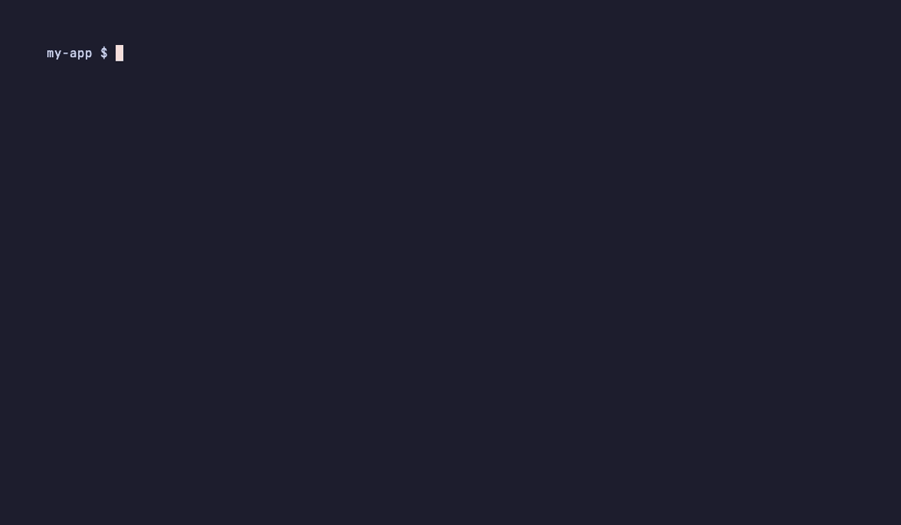

<p align="center">
  
</p>

# Dawn

[](https://github.com/cacheplane/dawnai/actions/workflows/ci.yml)
[](https://github.com/cacheplane/dawnai/actions/workflows/scorecard.yml)
[](./LICENSE)

The meta-framework for LangGraph. Author agents and workflows as filesystem routes, get types and a local dev server for free, and ship to LangSmith with one command.

<p align="center">
  
</p>

## Why Dawn?

- **Kill the graph boilerplate.** Export one `agent({ model, systemPrompt })` descriptor. Dawn discovers it, binds route-local tools, and emits a `langgraph.json` package ready for LangSmith.
- **Real project structure.** Filesystem routes under `src/app/` — colocate state schemas, tools, middleware, and tests next to the route they belong to. No more ad-hoc folders.
- **A local dev loop LangGraph never shipped.** `dawn dev` runs your routes locally with the same semantics as production. Iterate in seconds, not deploys.
- **Typed end to end.** Route params, state, and tool I/O are generated as TypeScript types. `dawn verify` is your pre-deploy gate.

## Without Dawn / With Dawn

Same `langgraph.json`, deployable to LangSmith. ~4× less code to author.

### Without Dawn

```ts
// graph.ts
import { StateGraph, MessagesAnnotation, START, END } from "@langchain/langgraph"
import { ToolNode } from "@langchain/langgraph/prebuilt"
import { ChatOpenAI } from "@langchain/openai"
import { tool } from "@langchain/core/tools"
import { z } from "zod"

const greet = tool(async ({ name }) => `Hello, ${name}!`, {
  name: "greet",
  description: "Greet a user by name.",
  schema: z.object({ name: z.string() }),
})

const model = new ChatOpenAI({ model: "gpt-4o-mini" }).bindTools([greet])
const tools = new ToolNode([greet])

async function callModel(state: typeof MessagesAnnotation.State) {
  return { messages: [await model.invoke(state.messages)] }
}

function shouldContinue(state: typeof MessagesAnnotation.State) {
  const last = state.messages.at(-1) as any
  return last?.tool_calls?.length ? "tools" : END
}

export const graph = new StateGraph(MessagesAnnotation)
  .addNode("agent", callModel)
  .addNode("tools", tools)
  .addEdge(START, "agent")
  .addConditionalEdges("agent", shouldContinue, ["tools", END])
  .addEdge("tools", "agent")
  .compile()
```

```json
// langgraph.json
{
  "dependencies": ["."],
  "graphs": { "hello": "./graph.ts:graph" },
  "node_version": "22",
  "env": ".env"
}
```

### With Dawn

```ts
// src/app/(public)/hello/[tenant]/index.ts
import { agent } from "@dawn-ai/sdk"

export default agent({
  model: "gpt-4o-mini",
  systemPrompt: "You are a helpful assistant for the {tenant} organization.",
})
```

```ts
// src/app/(public)/hello/[tenant]/tools/greet.ts
export default async ({ name }: { name: string }) => `Hello, ${name}!`
```

`dawn build` emits the `langgraph.json` for you.

## Quickstart

1. Create a new app.

```bash
pnpm create dawn-ai-app my-dawn-app
cd my-dawn-app
pnpm install
```

2. Validate the app and generate types in one call.

```bash
pnpm exec dawn verify
```

3. Run the scaffolded route. The route path must be quoted because it contains `(`, `)`, and `[]`.

```bash
echo '{"tenant":"acme"}' | pnpm exec dawn run "src/app/(public)/hello/[tenant]"
```

4. Optionally start the local runtime in one terminal and send the same route through `--url` from another terminal.

```bash
pnpm exec dawn dev --port 3001
echo '{"tenant":"acme"}' | pnpm exec dawn run "src/app/(public)/hello/[tenant]" --url http://127.0.0.1:3001
```

## 30-Second Route

Dawn routes live under `src/app` and export one runtime entry. New agent routes should use the `agent()` descriptor from `@dawn-ai/sdk`; Dawn discovers the route, binds route-local tools, generates types, and produces a `langgraph.json` package for LangSmith.

```ts
import { agent } from "@dawn-ai/sdk"

export default agent({
  model: "gpt-4o-mini",
  systemPrompt: "You are a helpful assistant for the {tenant} organization.",
  retry: { maxAttempts: 3, baseDelay: 250 },
})
```

Add `state.ts` for a route state schema, `tools/*.ts` for route-local tools, `middleware.ts` for access control, and `run.test.ts` for colocated scenarios.

## Learn more

- [Getting started](https://dawn-ai.org/docs/getting-started)
- [Routes](https://dawn-ai.org/docs/routes)
- [Tools](https://dawn-ai.org/docs/tools)
- [State](https://dawn-ai.org/docs/state)
- [CLI](https://dawn-ai.org/docs/cli)
- [Dev server](https://dawn-ai.org/docs/dev-server)
- [Testing](https://dawn-ai.org/docs/testing)
- [Deployment](https://dawn-ai.org/docs/deployment)

---

Contributions welcome — see [CONTRIBUTING.md](./CONTRIBUTING.md). Repo layout and dev commands in [CONTRIBUTORS.md](./CONTRIBUTORS.md). Security: [SECURITY.md](./SECURITY.md). Please follow the [Code of Conduct](./CODE_OF_CONDUCT.md).

## License

MIT. See [LICENSE](./LICENSE).
