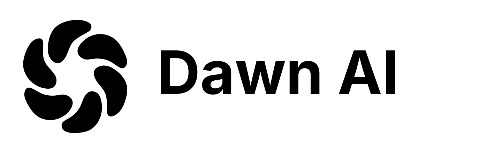

<p align="center">
  <picture>
    <source media="(prefers-color-scheme: dark)" srcset="docs/brand/dawn-logo-horizontal-white-on-black.png">
    
  </picture>
</p>

<p align="center"><strong>TypeScript meta-framework for LangGraph.js</strong></p>

# Build LangGraph agents like Next.js apps.

Dawn adds file-system routes, shared and route-local tools, generated types,
deterministic tests, durable threads, and build targets around LangGraph.js.
Keep the runtime. Drop the boilerplate.

<p align="center">
  <a href="https://www.npmjs.com/package/create-dawn-ai-app"></a>
  <a href="https://github.com/cacheplane/dawnai/actions/workflows/ci.yml"></a>
  <a href="./LICENSE"></a>
  <a href="https://github.com/cacheplane/dawnai/stargazers"></a>
  <a href="https://github.com/cacheplane/dawnai/actions/workflows/scorecard.yml"></a>
</p>

<p align="center">
  <a href="https://dawnai.org/docs/getting-started">Get started</a> ·
  <a href="https://dawnai.org/docs/migrating-from-langgraph">Migrate from LangGraph.js</a> ·
  <a href="https://dawnai.org/docs">Documentation</a> ·
  <a href="https://github.com/cacheplane/dawnai/discussions">Discussions</a>
</p>

```bash
npm create dawn-ai-app@latest my-agent
```

<p align="center">
  <a href="https://dawnai.org/#product-loop">
    
  </a>
</p>

[Read the product-loop transcript](docs/brand/demo/transcript.md).

## Quickstart

The first activation is the no-key path:

```bash
npm create dawn-ai-app@latest my-agent
cd my-agent
npm install
npm test
```

In a credential-sanitized clean-room run on August 31, 2026, npm resolved
`create-dawn-ai-app` 0.8.21; the generated starter installed and its default
fixture suite passed, with one opt-in test file skipped. The observation is
version- and date-specific; `@latest` can move. See the
[activation receipt](docs/brand/demo/evidence-matrix.md#clean-room-activation-observation).

## Why Dawn

- **Author the application shape, not route wiring.** Put one supported entry in
  a route's `src/app/**/index.ts`; Dawn discovers the route. Shared tools live in
  `src/tools/`, while route-local tools can live beside the route and remain
  subject to its runtime policy.
- **Let generated types follow the route.** Dawn generates TypeScript route,
  parameter, state, and tool declarations during typegen and build. State types
  are emitted when the discovered state schema supplies valid defaults.
- **Make the normal test loop deterministic.** Fixture-backed tests replay
  committed responses and fail on an unmatched interaction instead of silently
  calling a provider. Live and recording modes remain explicit opt-ins.
- **Carry one project from local state to build artifacts.** Default
  SQLite-backed state can survive a `dawn dev` restart when the app root and its
  SQLite files persist. The default build emits a runnable Node server,
  Dockerfile, and LangSmith graph artifacts; validate the runtime, storage, auth,
  and provider boundary for the deployment target you choose.

## How Dawn fits

| Layer | Role |
| --- | --- |
| **LangChain** | Remains available. Dawn's built-in `agent()` path uses LangChain integrations; raw graph and chain routes own their imports and provider behavior, and Dawn does not claim coverage for every LangChain package or provider. |
| **LangGraph.js** | Remains the graph runtime and is required by Dawn. Dawn adds application conventions around it rather than replacing it. |
| **Dawn** | Supplies file-system routing, generated types, local test and development conventions, persistence primitives, and build targets around LangGraph.js. |
| **Deployment and observability choices** | Model providers and LangSmith remain external. Dawn emits a Node runtime and LangSmith artifacts by default, with target-specific options documented separately; it does not provision infrastructure, host the app, or manage secrets. |

## What Dawn writes for you

| You author | Dawn discovers or emits |
| --- | --- |
| One `agent`, `workflow`, `graph`, or `chain` entry in a route's `index.ts` | The route identity and runtime entry |
| Shared tools in `src/tools/` and optional route-local tools in the route's `tools/` directory | The tool set available at that route, subject to tool policy and runtime constraints |
| Optional state schemas and typed tool signatures | Regenerated route, route-parameter, state, and tool declarations; state exports require discoverable defaults |
| Fixture-backed tests and application configuration | A deterministic replay path for those fixtures; live and recording paths stay explicit |
| Application source | A runnable Node server, Dockerfile, and LangSmith graph artifacts from the default build |

Already have a graph? Keep its nodes, edges, and imports, expose it as a raw
`graph` route, and validate invocation and checkpointer behavior for each target.
The [full migration guide](https://dawnai.org/docs/migrating-from-langgraph)
covers that incremental path.

## What are you building?

- [Research assistant](./examples/research/README.md)
- [Chat and workspace assistant](./examples/chat/README.md)
- [Memory-backed agent](./examples/memory/README.md)
- [Routes and workflows guide](https://dawnai.org/docs/routes)

## When Dawn fits

- **A good fit:** a TypeScript team wants LangGraph.js with file-system routes,
  generated types, a local test and development loop, persistence primitives,
  and build targets. Capability support varies by target, so validate the subset
  your application uses.
- **Stay with raw LangGraph.js:** if you do not want Dawn's application
  conventions, or if your project requires Python. Dawn requires LangGraph.js
  and targets TypeScript and Node.js.
- **Bring the ecosystem with you:** existing raw LangGraph.js graphs can migrate
  incrementally as `graph` routes. LangChain remains usable, and CopilotKit
  composes with Dawn through the tested AG-UI boundary; validate versions and
  target-specific invocation, provider, and checkpointer behavior in your app.

Dawn is not a hosted AI platform or an infrastructure provisioner. You operate
the emitted application or deploy it through a separate platform.

## Build with a coding agent

Give your coding agent the framework sources before it writes a route.

<details>
<summary>Copy this prompt</summary>

```text
Scaffold a new Dawn app and help me build an agent. Dawn is the TypeScript meta-framework for LangGraph — agents and workflows are file-system routes with route-local tools, generated types, and durable threads. Run `npm create dawn-ai-app@latest my-agent` to scaffold, then read https://dawnai.org/AGENTS.md and https://dawnai.org/llms-full.txt for the full framework reference before writing any routes.
```

</details>

## Run it live

Live model calls require credentials for the provider you select. For the
current checked-in research template, set the OpenAI key used by its
`gpt-5-mini` example, then start the server:

```bash
export OPENAI_API_KEY=sk-...
npm run dev:server
```

In a second terminal, start the Workbench:

```bash
npm run dev:web
```

The current source template serves the Dawn server on port 3002 and the
Workbench on port 3010. The published 0.8.21 scaffold observed in the clean-room
receipt used an earlier single-package shape on port 3000, so follow the README
generated by the version you install.

Use the [Workbench guide](https://dawnai.org/docs/recipes/research-web-ui) for
the browser client, or drive the same backend through the
[Agent Protocol](https://dawnai.org/docs/dev-server/agent-protocol).

Build and serve the default Node target with:

```bash
npm run build
npm start
```

Choose and validate the deployment boundary that matches your application:
[Node](https://dawnai.org/docs/deployment/node),
[LangSmith](https://dawnai.org/docs/deployment/langsmith),
[edge targets](https://dawnai.org/docs/deployment/edge), or
[Kubernetes](https://dawnai.org/docs/deployment/kubernetes). Dawn emits the
artifacts; it does not provision infrastructure, host the application, or
manage its secrets.

## Maturity and support

Dawn is pre-1.0 and its API surface is moving. Pin versions and read the
[release notes](https://github.com/cacheplane/dawnai/releases) and
[upgrade guide](https://dawnai.org/docs/upgrading). Supported means documented
public surfaces on the current release line, not a 1.0 stability or long-term
support guarantee.

- Follow [SUPPORT.md](./SUPPORT.md) for support routes, and ask usage questions
  in [GitHub Discussions](https://github.com/cacheplane/dawnai/discussions).
- Report security issues through the process in [SECURITY.md](./SECURITY.md).
- See [CONTRIBUTING.md](./CONTRIBUTING.md) and [CONTRIBUTORS.md](./CONTRIBUTORS.md) before contributing.
- Follow the [Code of Conduct](./CODE_OF_CONDUCT.md).

Ready to start?

```bash
npm create dawn-ai-app@latest my-agent
```

## License

MIT. See [LICENSE](./LICENSE).
